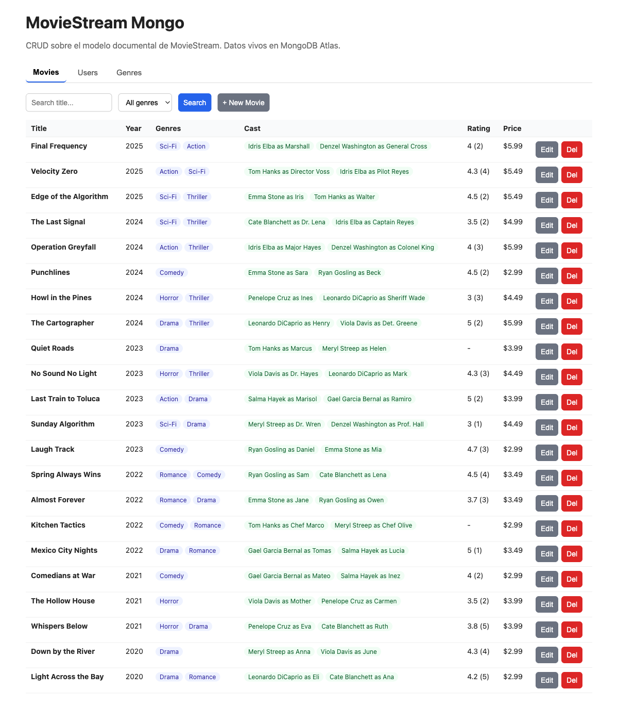

# MovieStream Mongo

Traducción del dominio MovieStream (que en el curso modelamos en Oracle relacional) a un modelo documental en MongoDB, con una app web mínima para hacer CRUD sobre los datos.

App pública desplegada: **(ver liga al final, se actualiza al hacer el deploy)**



## Qué hace

- Cuatro colecciones: `movies`, `genres`, `actors`, `users`.
- CRUD completo sobre `movies`, `users` y `genres` desde una sola interfaz HTML.
- Las películas se manejan con sus géneros (referencia + nombre denormalizado) y su reparto (referencia a actores + nombre del personaje, denormalizado).
- Los usuarios tienen sus interacciones embebidas (vistas, ratings y compras unificadas).
- Al borrar un género referenciado por películas, la app pregunta antes de eliminar.
- Al renombrar un género o una película, la app sincroniza la denormalización.
- El rating promedio de una película se recalcula automáticamente al agregar un rating.

## Stack

- **Node.js + Express** para el backend. Es la opción "más simple posible" que sugería la actividad y no tiene magia oculta.
- **MongoDB driver oficial** (no Mongoose), para que las decisiones del modelo se vean a ojo en el código y no las esconda un schema validator.
- **Frontend en un solo HTML + vanilla JS** (sin React, sin templates), porque el objetivo era ver los datos en acción, no demostrar habilidad con un framework.
- **MongoDB Atlas M0** (tier gratuito) como base.
- **Vercel** como host de la app, conectado a Atlas con allowlist abierta para que el deploy serverless pueda conectarse.

## Cómo correrlo desde cero

```bash
# 1. clonar
git clone https://github.com/AlejandroVallejo1/moviestream-mongo.git
cd moviestream-mongo

# 2. dependencias
npm install

# 3. configurar conexión a Mongo
cp .env.example .env
# editar .env con tu MONGODB_URI

# 4. poblar la base
npm run seed

# 5. correr
npm start
# abrir http://localhost:3000
```

## Estructura del repo

```
.
├── server.js          # API Express + lógica de CRUD
├── seed.js            # carga 7 géneros, 12 actores, 22 películas, 15 usuarios
├── public/
│   └── index.html     # frontend completo (vanilla JS)
├── api/
│   └── index.js       # entrypoint para Vercel (re-exporta server.js)
├── vercel.json        # config de routing para Vercel
├── MODEL.md           # justificación del modelo documental
├── REFLECTION.md      # respuestas a las preguntas de reflexión
└── README.md
```

## Documentos clave

- [`MODEL.md`](./MODEL.md) — el modelo documental con cada decisión justificada.
- [`REFLECTION.md`](./REFLECTION.md) — reflexión honesta sobre qué funcionó y qué no.

## Datos del seed

- 7 géneros: Action, Drama, Comedy, Sci-Fi, Horror, Romance, Thriller
- 12 actores
- 22 películas (con géneros y reparto consistentes)
- 15 usuarios, cada uno con entre 3 y 8 interacciones aleatorias entre vistas, ratings y compras

## Endpoints (resumen)

```
GET    /api/movies            ?q=&genre=
GET    /api/movies/:id
POST   /api/movies            { title, year, runtime_min, list_price, genre_ids, cast }
PUT    /api/movies/:id
DELETE /api/movies/:id

GET    /api/users             ?q=
GET    /api/users/:id
POST   /api/users
PUT    /api/users/:id
DELETE /api/users/:id
POST   /api/users/:id/interactions          { movie_id, type, rating, price }
DELETE /api/users/:id/interactions/:idx

GET    /api/genres            ?q=
POST   /api/genres
PUT    /api/genres/:id
DELETE /api/genres/:id        (409 si está referenciado; ?force=1 para cascade)

GET    /api/actors            ?q=
```
